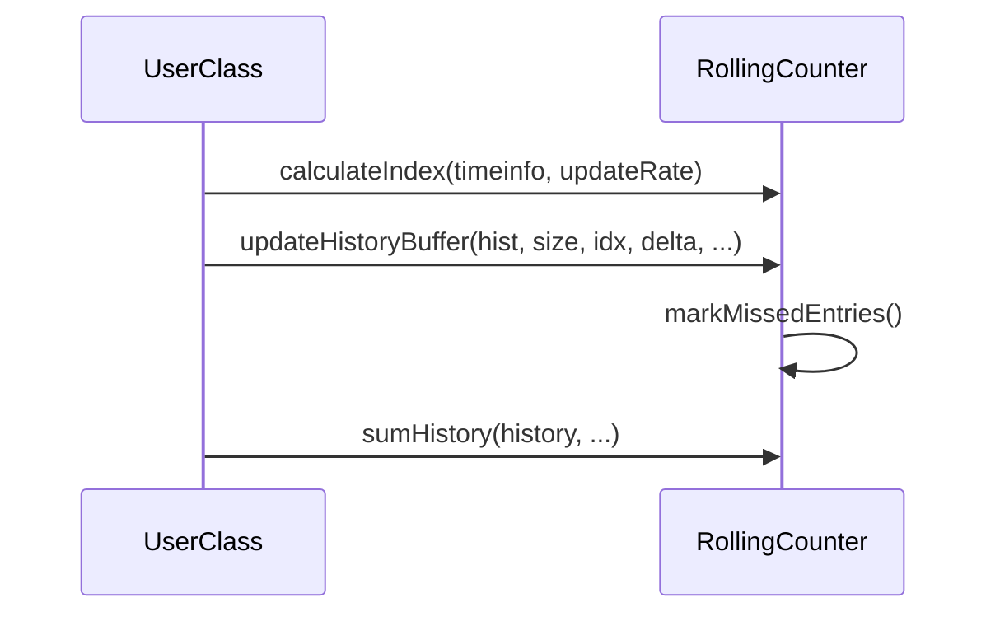
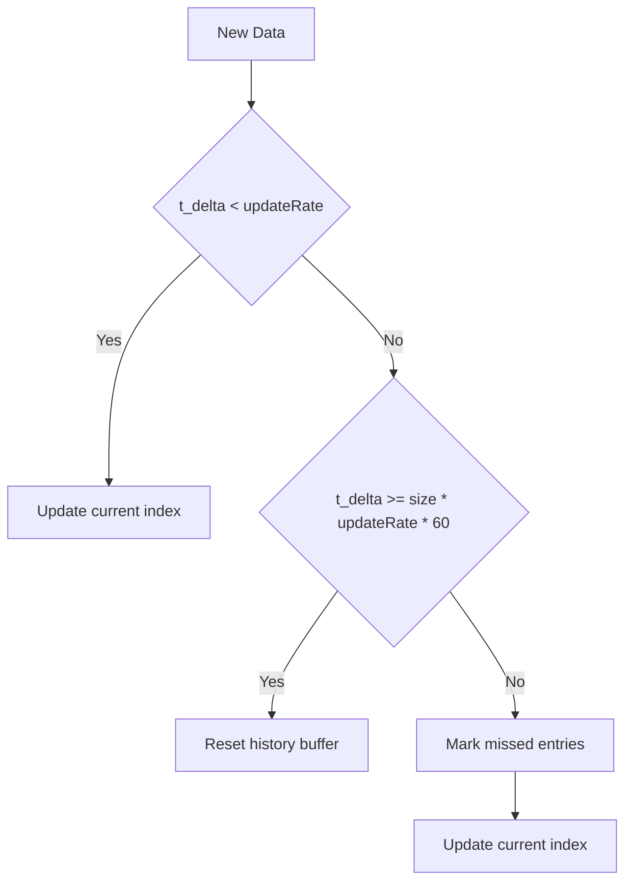

# RollingCounter Class Documentation

## Overview


**What is a Rolling Counter?**  
A rolling counter is a data structure that tracks the sum or count of events over a moving time window (for example, the last hour or last 24 hours). Instead of storing every event, it divides the window into fixed-size bins (such as minutes or hours) and updates these bins as new data arrives. As time progresses, old data is overwritten, so the buffer "rolls" forward, always representing the most recent period.

**What is a History Buffer?**  
A history buffer is an array or circular buffer that holds the values for each time bin. Each entry typically represents the total or count of events that occurred in a specific interval (e.g., one minute or one hour).

**Visual Representation:**

```
   ---------------     -----------
  |   |   |   |   |...|   |   |   |   hist[RAIN_HIST_SIZE]
   ---------------     -----------
    ^
    |
     idx = t.tm_min / updateRate
```

**When is this concept used?**  
Rolling counters and history buffers are widely used in embedded systems, IoT, and monitoring applications where you need to efficiently track statistics over a recent time window without storing all raw data. Typical use cases include:
- Weather stations (e.g., rainfall in the last hour, lightning strikes in the last 24 hours)
- Network traffic monitoring (e.g., bytes sent in the last 10 minutes)
- Industrial sensors (e.g., machine cycles per hour)
- Any scenario where you want to display or analyze recent activity trends

**Note:** This concept works not only when every individual event or measurement is received immediately, but also when only an accumulated value (such as a total count or sum) is received at regular or irregular intervals. In these cases, the rolling counter logic computes the difference (delta) between the new and previous accumulated values to determine the number of events or amount of change that occurred during each interval. This makes rolling counters ideal for sensors or systems that report only periodic totals, such as cumulative rainfall or energy meters.

**Energy Efficiency:**
Because the system only needs to process and store accumulated values at defined intervals, the receiver (or microcontroller) can enter low-power or sleep modes between sensor receptions or measurement updates. This significantly reduces energy consumption, which is especially important for battery-powered or remote IoT devices.

The `RollingCounter` class is a base class for time-based rolling counter implementations, such as RainGauge and Lightning. It provides generic functionality for managing history buffers, handling time-based indexing, and calculating aggregates with quality metrics. The class is designed for extensibility and code reuse, supporting both minute-based and hour-based history tracking.

### Key Features

- Generic rolling history buffer management
- Flexible time indexing (minute/hour granularity)
- Quality metrics for aggregate calculations
- Extensible for different sensor types
- Support for non-volatile storage via Preferences library

---

## User's Guide

### Typical Usage

1. **Inheritance**  
   Derive your sensor class from `RollingCounter` and implement the pure virtual `hist_init()` method.

2. **History Buffer Update**  
   - Calculate the index using `calculateIndex()`:
     ```cpp
     int idx = calculateIndex(timeinfo, updateRate);
     ```
   - Update the history buffer:
     ```cpp
     updateHistoryBuffer(hist, size, idx, delta, t_delta, timestamp, lastUpdate, updateRate);
     ```
   - For custom initialization (e.g., 24h buffer), use:
     ```cpp
     UpdateResult result = updateHistoryBufferCore(hist24h, size24h, idx24h, delta, t_delta, timestamp, lastUpdate, 60);
     if (result == UPDATE_EXPIRED) {
         hist24h_init();
     }
     ```

3. **Aggregate Calculation**  
   Use `sumHistory()` to compute totals and quality metrics:
   ```cpp
   float total = sumHistory(history, &valid, &nbins, &quality, scale);
   ```

### Example Sequence



---

## Implementation Specification

### Public Methods

- `int calculateIndex(const struct tm& tm, uint8_t rate) const`  
  Calculates the index for the history buffer based on time and update rate.

- `void updateHistoryBuffer(...)`  
  Updates the history buffer, handling missed entries and buffer expiration.

- `UpdateResult updateHistoryBufferCore(...)`  
  Core update logic, returns result code for custom initialization.

- `float sumHistory(const History& h, ...)`  
  Sums valid entries in the history buffer, with optional quality metrics.

- `virtual void hist_init(int16_t value = -1) = 0`  
  Pure virtual method for buffer initialization, must be implemented by derived classes.

### Protected Members

- `float qualityThreshold`
- `time_t lastUpdate`
- `uint8_t updateRate`

### History Buffer Structure

```cpp
typedef struct {
    int16_t*  hist;         // pointer to buffer
    size_t    size;         // number of bins
    uint8_t   updateRate;   // minutes per bin
} History;
```

### Index Calculation

- For minute-based buffers: `idx = tm.tm_min / updateRate`
- For hour-based buffers: `idx = tm.tm_hour` (when `updateRate >= 60`)

### Buffer Update Logic



---

## Preferences Library Usage

### Purpose

The Preferences library is used for non-volatile storage of history buffer and sensor state, ensuring persistence across device restarts.

### Usage Pattern

- **Load State:**  
  On startup or before update, load state from Preferences:
  ```cpp
  preferences.begin("namespace", false);
  value = preferences.getType("key", default);
  preferences.end();
  ```

- **Save State:**  
  After updating history or sensor state, save to Preferences:
  ```cpp
  preferences.begin("namespace", false);
  preferences.putType("key", value);
  preferences.end();
  ```

- **Optimization:**  
  To reduce flash writes, only store essential state and buffer entries.

### Example

```cpp
preferences.begin("BWS-RAIN", false);
preferences.putULong64("lastUpdate", nvData.lastUpdate);
for (int i=0; i<RAIN_HIST_SIZE; i++) {
    char buf[7];
    sprintf(buf, "hist%02d", i);
    preferences.putShort(buf, nvData.hist[i]);
}
preferences.end();
```

---

## Summary

The RollingCounter class provides a robust, extensible foundation for time-based sensor data aggregation, with flexible indexing, quality metrics, and persistent storage support. Use its public methods for consistent buffer management and extend it for your specific sensor needs.
